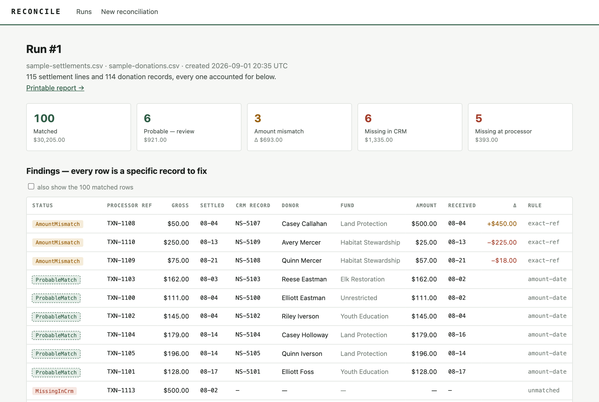
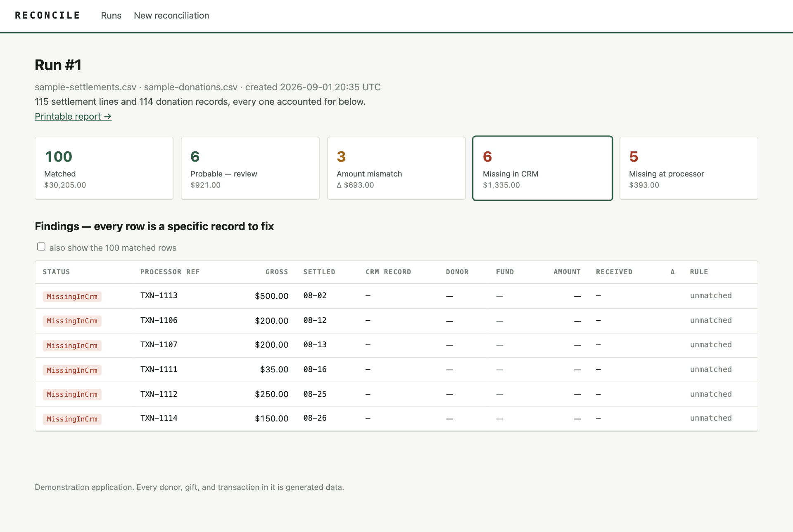
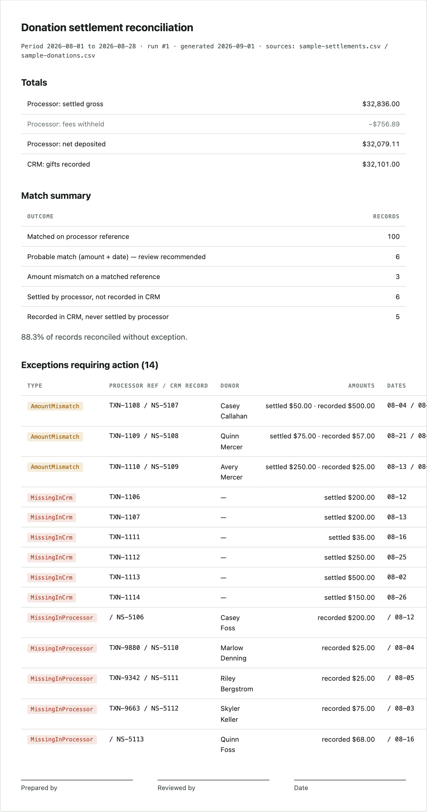

# Reconcile

Every dollar a donor gives should be findable in both systems. Reconcile
matches a payment processor's settlement export against a CRM's donation
records, one record at a time, and reports each mismatch as a specific thing
to fix.



Built in C# on modern .NET (ASP.NET Core MVC, EF Core code-first, SQL Server)
as a working demonstration of AI-assisted development with review discipline.
The stack was new to me on day one; [BUILD-LOG.md](BUILD-LOG.md) records what
that cost, with dates. [CLAUDE.md](CLAUDE.md) is the context and
conventions file every AI coding session loads first.

## What it does

1. **Import** two CSV exports for the same period: what the processor settled
   (transaction ref, gross, fee, net, date, batch) and what the CRM recorded
   (record id, processor ref if captured, donor, fund, amount, date). Rows
   that fail to parse are kept out and reported on the run. Nothing is dropped
   silently.
2. **Match** with an ordered chain of rules. Exact processor-reference matches
   claim first; a fallback pairs ref-less gifts (phone, mail) by amount and a
   date window, but only when a single settlement could explain the gift.
   Ambiguity is left unmatched on purpose. A guess recorded as a match is
   worse than an honest exception.
3. **Account for everything.** Every settlement line and every donation record
   lands in one result and only one: matched, probable, amount mismatch, missing in
   CRM, or missing at processor. The invariant is enforced by test.
4. **Drill down.** Each tile on the findings page filters to the records behind
   it.



5. **Report.** A print-ready reconciliation: totals on both sides, fees
   withheld, match summary, itemized exceptions, sign-off lines.



## Try it in two minutes

You need the .NET 10 SDK and Docker (or colima).

```sh
docker run -d --name reconcile-sql -e ACCEPT_EULA=Y \
  -e "MSSQL_SA_PASSWORD=Reconcile!Dev2026" -p 1433:1433 \
  mcr.microsoft.com/mssql/server:2022-latest

dotnet tool install --global dotnet-ef
dotnet ef database update --project src/Reconcile.Web
dotnet run --project src/Reconcile.Web
```

Open the URL it prints, choose **New reconciliation**, and click **Run the
sample month**. The sample is generated data with planted defects (keying
errors, references never captured, gifts the processor never settled, and one
engineered ambiguity) so the findings page has something to show. Every
donor in it is invented.

`dotnet test` runs the suite: the matching engine's promises, CSV import
behavior, and a test that predicts how the engine classifies the
sample month (100 / 6 / 3 / 6 / 5).

## Architecture

```
src/Reconcile.Core    Domain, matching engine, CSV import, sample generator.
                      Pure C#. No EF, no web. Fully unit-testable.
src/Reconcile.Web     ASP.NET Core MVC + EF Core (SQL Server, code-first
                      migrations). Persistence and presentation only.
tests/                xUnit.
infra/main.bicep      Azure App Service + Azure SQL, as code.
.github/workflows     CI: restore, build, test on every push and PR.
```

The matching engine is a chain of `IMatchRule` strategies run in confidence
order (Strategy + Chain of Responsibility, if you want the pattern names).
Adding a rule is one class and one line in the chain; the accounting
invariant test tells you immediately if the new rule double-claims.

Server-rendered views, one hand-written stylesheet, about twenty lines of
vanilla JavaScript. Every page works with scripting off.

## Deploying to Azure

`infra/main.bicep` provisions an App Service plan, a Linux web app on .NET
10, an Azure SQL server and database, and injects the connection string, so
the app runs unchanged between local SQL Server and Azure SQL. Deploy steps
are in the file header. The template compiles clean; it has not yet been run
against a live subscription.

## What this is not

- Not connected to any real payment processor or CRM. The import shapes are
  modeled on typical exports; wiring them to live APIs is the obvious next
  step and out of scope for a demonstration.
- No authentication. Anyone who can reach it can use it. Don't put it on the
  public internet with real data. The repo contains none.
- Not a product. It demonstrates how I work, and the build log is the record.

## How it was built

By me directing Claude Code, with every change reviewed before it landed,
starting from zero C#. The build log has the dated record, including what
review caught. Commits carry a Claude co-author line for the same reason.

MIT licensed. Dustin Mennie, Missoula, Montana.
